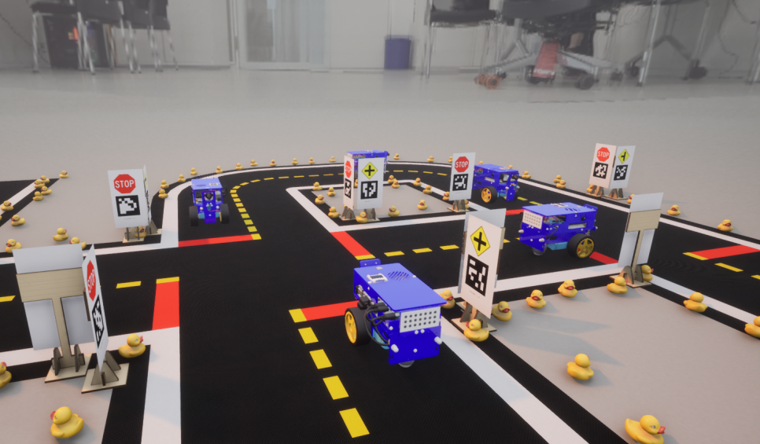
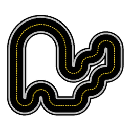
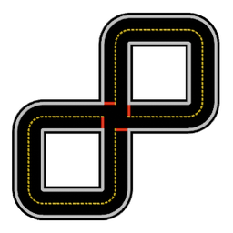
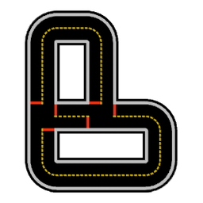
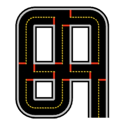

<div align="center">


<h1>CARLA Duckietown</h1>



<br/>

<p>
  
  
  
</p>

<p>
  <a href="#features"><b>Features</b></a> &nbsp;·&nbsp;
  <a href="#prebuilt-release"><b>Prebuilt release</b></a> &nbsp;·&nbsp;
  <a href="#building-from-source"><b>Building from source</b></a> &nbsp;·&nbsp;
  <a href="#getting-started"><b>Getting started</b></a> &nbsp;·&nbsp;
  <a href="#documentation"><b>Documentation</b></a>
</p>

</div>

Data scarcity is the biggest bottleneck for end-to-end systems in Duckietown. Real footage is limited, and manual labeling is painstakingly slow. CARLA Duckietown solves this by providing photorealistic simulation environments equipped with modular sensors, dynamic lighting, and fully controllable traffic and props.

> [!IMPORTANT]
> **This is a modified CARLA, not an asset pack.** The simulator and the Python
> client are both changed, so they are not interchangeable with stock CARLA. Use
> the client that comes with this project — the `carla` package from PyPI will not
> work against this server, and this client will not work against an upstream
> CARLA server. Match the client and the server to the same build.

## Features

|  |  |
|---|---|
| **Six Duckietown maps** | Complete layouts with full road network data, so waypoints, the Traffic Manager and autopilot all work as usual. |
| **Duckiebot** | Drive the Duckiebot like any other CARLA vehicle, as well as rubber duckies to scatter across the map. |
| **Signs** | The Duckietown sign set. Place a sign anywhere and choose which one it shows. |
| **Duckietown segmentation** | Seven extra semantic labels for lane markings, road surface, stop lines, signs, Duckiebots and duckies. |
| **HDRI backdrops** | Switch the scene's lighting and background between named presets while the simulation runs. Every map ships with its own. |
| **Hide actors from cameras** | Make a vehicle invisible to sensors while it keeps driving and colliding — for clean ego-view capture. |
| **Ready-made scripts** | Drive manually, generate traffic, scatter rubber duckies and cycle through lighting presets. |

### Map-Overview

| `duckietown_01` | `duckietown_02` | `duckietown_03` | `duckietown_04` | `duckietown_05` | `duckietown_06` |
|:---:|:---:|:---:|:---:|:---:|:---:|
|  |  |  |  |  |  |

---

## Prebuilt release

No Unreal Engine, no 2-hour compile: the packaged build ships the simulator with
all six Duckietown maps baked in, plus a matching Python API wheel. The package is
Linux-only — on Windows, see [Windows](#windows) below.

**Release `1.0`** — 2026-08-13 · [release notes](https://github.com/duckietown/carla/releases/tag/1.0)

### Requirements

* __Ubuntu 22.04 or 26.04__ and an __NVIDIA GPU__ with at least 8 GB of VRAM.
* __12 GB of disk space__ once unpacked.
* __Python 3.10 or 3.12__ — the client is a compiled extension, so it works only
  with the exact version its wheel was built for. 3.10 is the system Python on
  22.04, 3.12 on 26.04.
* One runtime library — the rest of the build requirements do not apply:

```sh
sudo apt-get install libvulkan1
```

### Downloads

| File | Contents | Size |
| --- | --- | --- |
| [`CARLA_Duckietown-1.0.tar.gz.part00` … `.part02`](https://github.com/duckietown/carla/releases/tag/1.0) | Simulator, maps, assets, HDRI presets, the scripts and both wheels. Split across three parts to stay under the 2 GB limit on release assets | `5.0 GB` total |
| [`carla_duckietown-1.0-cp310-cp310-linux_x86_64.whl`](https://github.com/duckietown/carla/releases/download/1.0/carla_duckietown-1.0-cp310-cp310-linux_x86_64.whl) | Python API client, Python 3.10 (Ubuntu 22.04) | ~30 MB |
| [`carla_duckietown-1.0-cp312-cp312-linux_x86_64.whl`](https://github.com/duckietown/carla/releases/download/1.0/carla_duckietown-1.0-cp312-cp312-linux_x86_64.whl) | Python API client, Python 3.12 (Ubuntu 26.04) | ~30 MB |

### Installing

__1.__ **Download and unpack the simulator.** The parts are only meaningful
concatenated, so fetch them all and pipe them straight into `tar` — nothing needs
to be reassembled on disk first:

```sh
mkdir -p ~/CarlaDuckietown && cd ~/CarlaDuckietown

for p in 00 01 02; do
  curl -fL -C - -O "https://github.com/duckietown/carla/releases/download/1.0/CARLA_Duckietown-1.0.tar.gz.part$p"
done

cat CARLA_Duckietown-1.0.tar.gz.part* | tar -xzf -
rm CARLA_Duckietown-1.0.tar.gz.part*
```

`curl -C -` resumes, so re-running the loop after a dropped connection picks up
where it left off rather than starting over.

__2.__ **Install the Python client.** Use the wheel bundled under
`PythonAPI/carla/dist` — it is built against this exact release. A `carla` wheel
from PyPI will not work:

```sh
python3 -m pip install --upgrade -r PythonAPI/carla/requirements.txt
python3 -m pip install PythonAPI/carla/dist/carla_duckietown-*.whl
```

**Client only.** If the simulator runs on another machine and you just need the
Python API, skip the package entirely and install the wheel for your Python
version straight from the release:

```sh
python3 -m pip install https://github.com/duckietown/carla/releases/download/1.0/carla_duckietown-1.0-cp310-cp310-linux_x86_64.whl
```

Keep the client and the server on the same release. A wheel from a different
build will warn about a version mismatch on connect.

The distribution is named `carla_duckietown` but it still provides the `carla`
module, so it cannot coexist with upstream's `carla` package — pip will not spot
the conflict for you. If you have ever installed `carla` from PyPI, remove it
first:

```sh
python3 -m pip uninstall carla
```

### Running

```sh
./CarlaUE4.sh                              # windowed, boots into duckietown_01
./CarlaUE4.sh -RenderOffScreen             # headless, for data generation
./CarlaUE4.sh -quality-level=Low           # cheaper rendering
./CarlaUE4.sh -carla-rpc-port=3000         # non-default port
```

The server listens on ports 2000 and 2001 by default. The first launch is slower
while shaders warm up. With the simulator running, continue to
[Getting started](#getting-started) — every script works the same as in a source
build.

**Frame rate.** Rendering is capped at 60 FPS. The Duckietown maps are light
enough that an uncapped server idles at several hundred frames per second, which
buys nothing and makes some GPUs whine. To change it, edit `FrameRateLimit` in
`CarlaUE4/Config/DefaultGameUserSettings.ini`, or in
`~/.config/Epic/CarlaUE4/Saved/Config/LinuxNoEditor/GameUserSettings.ini` once
that file exists — the saved copy wins. `0` is uncapped.

Note that this is a *rendering* cap and is independent of simulation timing: the
`-benchmark` and `-fps=` command line flags have no effect on a packaged build,
and for reproducible, evenly spaced sensor captures you want
`fixed_delta_seconds` and `synchronous_mode` from the client instead.

---

## Building from source

Build from source if you want the Unreal Editor, need to change the C++ code, or want to
author your own maps and assets. Otherwise the [prebuilt release](#prebuilt-release) above is
the shorter road.

**→ [Linux build guide](Docs/build_linux.md)**

The full procedure lives there. In outline:

| | |
|---|---|
| **1. Install the prerequisites** | A handful of apt packages. Ubuntu 22.04 and 26.04 are the supported versions. |
| **2. Build Unreal Engine 4.26** | CARLA's [patched fork](https://github.com/CarlaUnreal/UnrealEngine) — the Epic Games Launcher build will not work, and cloning it needs a GitHub account linked to Epic. This is the bulk of the time. |
| **3. Clone and fetch the content** | `git clone -b ue4-dev`, then `./Update.sh` to pull the CARLA and Duckietown asset archives. |
| **4. `make PythonAPI` and `make launch`** | Builds the client wheel, then compiles the server and opens the Editor. |

Budget __3-4 hours__ and __130 GB of disk space__; most of both goes to Unreal Engine. A
dedicated NVIDIA GPU with 8 GB of VRAM or more and 32 GB of RAM make for a comfortable
workflow in the Editor. The [F.A.Q.](Docs/build_faq.md) covers the most common complications.

### Windows

We develop exclusively on Ubuntu and cannot make any guarantees for Windows.
That said, CARLA itself builds natively on Windows and this fork keeps that
toolchain intact, so a Windows build should be within reach: follow the
[upstream Windows instructions](https://carla.readthedocs.io/en/latest/build_windows/),
substituting this repository for `carla-simulator/carla`.

[`Update.bat`](Update.bat) mirrors `Update.sh`, including the Duckietown content
download and the same `-s` / `-d` flags — but that half has never been run on
Windows, so expect to fix something. It additionally needs `python` on `PATH`
with the `requests` package, and `tar.exe` (shipped with Windows 10 1803 and
newer, with 7-Zip as a fallback). If it fails, the archive can always be fetched
by hand from the ID in
[`Util/DuckietownContentVersions.txt`](Util/DuckietownContentVersions.txt) and
extracted into `Unreal\CarlaUE4\Content`.

---

## Getting started

With the simulator running, in a second terminal:

```sh
cd PythonAPI/duckietown
python3 manual_control.py          # drive a Duckiebot
```

<table>
<tr>
<td valign="top" width="42%">

**Controls**

| Key | Action |
|---|---|
| `W` `A` `S` `D` | drive |
| `U` / `Shift+U` | next / previous map |
| `J` / `Shift+J` | cycle HDRI presets |
| `` ` `` or `N` | next sensor |
| `P` | toggle autopilot |
| `H` | full key list |

</td>
<td valign="top">

**Scripts**

| Script | Purpose |
|---|---|
| `manual_control.py` | Drive a Duckiebot; switch maps, lighting and sensors live |
| `generate_traffic.py` | Populate a map with autopiloted Duckiebots |
| `place_duckies.py` | Scatter rubber duckies along the road; `--cleanup` removes them |
| `hdri_control.py` | List, apply and disable HDRI presets |

</td>
</tr>
</table>

---

## Documentation

- **[Python API reference](Docs/python_api.md)** — including `set_hdri_preset`, `get_hdri_presets` and `set_hidden_in_game`
- **[Sensors reference](Docs/ref_sensors.md)** — semantic tags, including Duckietown tags `29`–`35`
- **[Blueprint library](Docs/bp_library.md)** — every spawnable actor
- **[Core concepts](Docs/core_concepts.md)** — client, world, actors, sensors

---

## Contributing

Contributions are welcome — open an issue or a pull request.

---

## Licenses

This build inherits CARLA's licensing. CARLA specific code is distributed under **MIT License**;
CARLA specific assets under **CC-BY License**. 

The ad-rss-lib library compiled and linked by the [RSS Integration build variant](Docs/adv_rss.md) introduces [LGPL-2.1-only License](https://opensource.org/licenses/LGPL-2.1).

Unreal Engine 4 follows its [own license terms](https://www.unrealengine.com/en-US/faq).

CARLA uses three dependencies as part of the SUMO integration:
- [PROJ](https://proj.org/), a generic coordinate transformation software which uses the [X/MIT open source license](https://proj.org/about.html#license).
- [SQLite](https://www.sqlite.org), part of the PROJ dependencies, which is [in the public domain](https://www.sqlite.org/purchase/license).
- [Xerces-C](https://xerces.apache.org/xerces-c/), a validating XML parser, which is made available under the [Apache Software License, Version 2.0](http://www.apache.org/licenses/LICENSE-2.0.html).

CARLA uses one dependency as part of the Chrono integration:
- [Eigen](https://eigen.tuxfamily.org/index.php?title=Main_Page), a C++ template library for linear algebra which uses the [MPL2 license](https://www.mozilla.org/en-US/MPL/2.0/).

CARLA uses the Autodesk FBX SDK for converting FBX to OBJ in the import process of maps. This step is optional, and the SDK is located [here](https://www.autodesk.com/developer-network/platform-technologies/fbx-sdk-2020-0)

This software contains Autodesk® FBX® code developed by Autodesk, Inc. Copyright 2020 Autodesk, Inc. All rights, reserved. Such code is provided "as is" and Autodesk, Inc. disclaims any and all warranties, whether express or implied, including without limitation the implied warranties of merchantability, fitness for a particular purpose or non-infringement of third party rights. In no event shall Autodesk, Inc. be liable for any direct, indirect, incidental, special, exemplary, or consequential damages (including, but not limited to, procurement of substitute goods or services; loss of use, data, or profits; or business interruption) however caused and on any theory of liability, whether in contract, strict liability, or tort (including negligence or otherwise) arising in any way out of such code."

---

## Authors of CARLA-Duckietown
- [Paul Masan](https://github.com/Raining-Cloud/)
- [Simon Rappenecker](https://github.com/DerSimi/)

---

<div align="center">

Built on the [CARLA simulator](https://github.com/carla-simulator/carla) · `ue4-dev`

<sub><i>CARLA: An Open Urban Driving Simulator</i> — Dosovitskiy, Ros, Codevilla, Lopez, Koltun; PMLR 78:1-16</sub>

</div>
